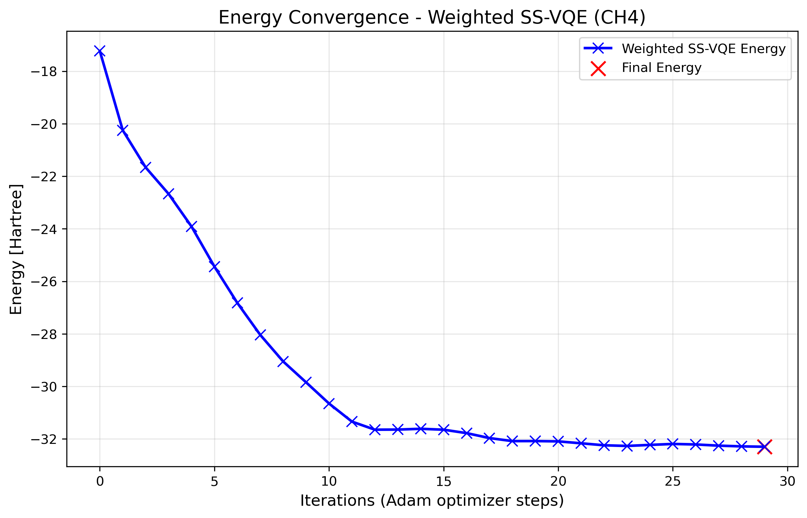

#  Quantum Molecules Quest: Hacking Ground and Excited States with SS-VQE

## Team Members
- Noah Nzeki William

## Concept Description
This project utilizes quantum variational algorithms, specifically the Subspace-Search Variational Quantum Eigensolver (SS-VQE), to compute the ground and excited state energies of molecular systems. Accurately determining molecular electronic energies is essential for predicting chemical bonding, stability, and photochemical behavior, yet classical methods scale exponentially with system size, making them computationally demanding. This project attempts to  leverage quantum computing in the effort to address the computational bottleneck in simulating molecular systems more efficiently. The methane molecule is chosen as a benchmark molecule due to its simplicity and environmental importance as a potent greenhouse gas influencing climate change.

## How the Solution Works
The solution uses a hybrid quantum–classical workflow implemented in Qiskit. A parameterized quantum circuit (ansatz) encodes trial molecular wavefunctions, while the SS-VQE algorithm optimizes these parameters to minimize the expectation value of the Hamiltonian, efficiently finding both ground and excited states simultaneously.

The workflow includes:
- Hamiltonian construction from molecular integrals using second quantization and fermion-to-qubit mappings.
- Quantum circuit design for each target state, composed dynamically and visualized for clarity.
- Parameter-shift rule for gradient computation, ensuring accurate and hardware-efficient optimization.
- Custom Adam optimizer for stable convergence.
- Validation through comparison with exact diagonalization and PySCF FCI results.

This approach demonstrates that quantum algorithms can deliver accurate, stable, and computationally efficient molecular simulations, offering a scalable pathway toward quantum-enhanced materials discovery, catalysis, drug discovery, and environmental chemistry.

## Demo / Screenshots

## GitHub Repository Link
Paste the link to your project repo here

